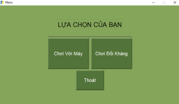
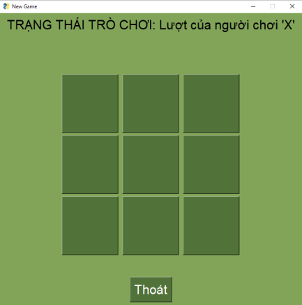

# LẬP TRÌNH TRÒ CHƠI CỜ CARO 3X3

## **GIỚI THIỆU**

- Lazzy again 

## **NỘI DUNG**

- [I - Hình thức sản phẩm](#i---hình-thức-sản-phẩm)

- [II - Thuật toán](#ii---thuật-toán)

- [III - Tính sáng tạo](#iii---tính-sáng-tạo)

- [IV- Công dụng & Ý nghĩa](#iv--công-dụng--ý-nghĩa)

## I - Hình thức sản phẩm

- Sử dụng ngôn ngữ lập trình ``Python`` để xây dựng thuật toán

- Sử dụng framework ``PySimpleGUI`` để thiết kế giao diện

- Người chơi có thể chơi trên file `TicTacToeGame_To3.exe` hoặc `RunGame.bat` trog folder `run bat` tùy theo nhu cầu.

## II - Thuật toán

-	Chương trình hiển thị:
    + Dựa vào thông tin được người dùng nhập ở cửa sổ khởi đầu để hiện thị thông tin người/máy tương ứng.
    
    + Tạo bảng gồm 9 nút bấm xếp thành hình vuông.
    
    + Dùng biến đếm `turn `để tính lượt.

        • Nếu là lượt lẻ thì cho ‘X’ đi.

        • Lượt chẵn thì cho ‘O’ đi.
    + Kiểm tra xem ô người chơi vừa chọn đã được chọn trước đó chưa. Nếu ô đã được chọn thì *báo lỗi* và yêu cầu người chơi chọn lại.
    + Khi người dùng bấm vào nút trống thì sẽ hiển thị kí hiệu tương ứng vào nút trống.
    + Kiểm tra nếu bảng đã được điền hết thì báo kết quả hoà.
    + Chạy chương trình kiểm tra các hàng ngang, cột dọc và đường chéo để xem có người thắng hay chưa ở mỗi vòng lặp lượt chơi.
    + Khi đã có kết quả thì chặn người chơi đánh tiếp bằng 1 biến kiểm tra.

-	Thuật toán tìm lượt đi của máy:
    
    + Kiểm tra xem có cách nào để máy thắng trong 1 nước đi không? Nếu có thì đánh vào ô để có kết quả thắng.

    + Kiểm tra xem có cách nào để người chơi thắng trong 1 nước đi không? Nếu có thì đánh vào ô để chặn người chơi chiến thắng.
    + Ưu tiên đánh góc: kiểm tra xem trong 4 góc có góc nào chưa đánh không? Nếu có nhiều hơn 1 góc thì trả về 1 góc ngẫu nhiên.
    + Kiểm tra vị trí trung tâm nếu chưa được đánh thì trả về vị trí trung tâm.
    + Nếu vẫn không tìm được ô thoả mãn thì trả về 1 vị trí ngẫu nhiên trong các vị trí còn lại.

## III - Tính sáng tạo 

### a. Thiết kế UI

- Ứng dụng `PySimpleGUI` để thiết kế đồ hộ giúp chương trình dễ tiếp cận hơn với mọi đối tượng người dùng

- Thay vì sử dụng giấy -> sáng tạo trong việc ứng dụng công nghệ vào trò chơi.

- Sử dụng `layout` , `windown` dễ dàng trong việc thiết lập chỉnh sửa các `buton`.

- Sử dụng `finalize` trong việc thiết lập tỉ lệ khung hình giúp trò chơi tương thích hơn trên mọi máy(màn hình máy)

### b. Hướng dẫn 

- Cách chơi đơn giản , giao diện dễ sử dụng.

    
    
- Thiết lập 2 chế độ chơi với máy và đối kháng

    

## IV- Công dụng & Ý nghĩa

- Công dụng giải trí

- Rèn luyện trí óc

- Mục đích giáo dục , tăng khả năng tư duy suy luận 

- Rèn luyện khả năng quan sát và phản xạ nhanh nhạy
- Góp phần cải thiện tầm nhìn
- Mở rộng tư duy
- Giảm căng thẳng sau giờ học, giờ làm
